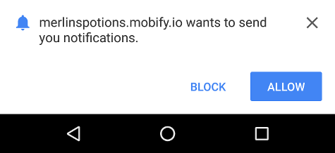
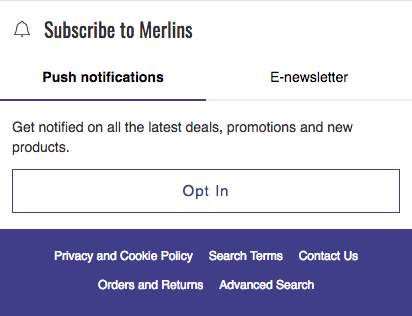

  

    <strong>Important:</strong> We've removed this article from the site navigation because Mobify projects that were generated after January 2019 do _not_ include the push messaging technology described below. If you are maintaining a project that was generated before January 2019 that _does_ include push messaging, we have left this documentation in place for you.
  

We're going to look at using three Push messaging components that are included
in a generated project:
* [InlineAsk](#inline-ask) [_(see React documentation)_](../../components/#!/InlineAsk)
* [DefaultAsk](#default-ask) [_(see React documentation)_](../../components/#!/DefaultAsk)
* [PushMessagingController](#push-messaging-controller) [_(see React documentation)_](../../components/#!/PushMessagingController)

**IMPORTANT:** To learn more about one of the SDK components mentioned here,
click its name to view the complete documentation associated with it in our [Web
Components](../../components/) section.

## Before you begin 

- Follow the steps in the [Configuring Push Messaging](../configuration) guide
  to set up your project for push messaging
- You must be using version **v0.22.0 or greater** of the Progressive Web SDK to
  use these push messaging components
- Push messaging is only compatible with Chrome and Firefox for Android and desktop
- The customer site must be HTTPS-everywhere

## "Ask" components 

Ask components provide a description of the value proposition for subscribing
to push notifications and a button to continue with the subscription flow.

Choosing to continue the subscription flow causes the browser to display a modal
dialog box that asks the user to give the browser permission to send push
messages (or *notifications* as Google Chrome calls them):

(_Google Chrome's modal dialog box that asks for permission to send push
messages that appears when the user continues the subscription flow_)

If the user blocks push messaging, you will not have another opportunity to ask
the user to subscribe unless they specifically unblock your site.

### The InlineAsk component 

The [InlineAsk](../../components/#!/InlineAsk) component is typically included
"inline" in the app as a compelling way to engage with visitors. For example,
it might be presented to visitors in a newsletter email section as a way to hear
about deals and news or on an order confirmation page as a way to be notified
of shipping status.

### The DefaultAsk component 

The [DefaultAsk](../../components/#!/DefaultAsk) components appears as a
sheet at the bottom of the page. Uniquely, it provides a button to dismiss the
subscription flow and is typically displayed after the user views a predefined
number of pages. The component's `showOnPageCount` prop determines how many pages
the visitor needs to view before it is shown.

Choosing to dismiss the subscription flow will trigger a visit countdown until
the [DefaultAsk](../../components/#!/DefaultAsk) component is shown again.
The number of visits is configured via the component's `deferOnDismissal` prop.

## The PushMessagingController component 

The [PushMessagingController](../../components/#!/PushMessagingController)
component initializes the push messaging client. The push messaging client is
the software that handles subscriptions, receives push notifications, and
triggers events when notifications are clicked. It also provides a way to
configure the app-wide setting for screen dimming when displaying the
[DefaultAsk](../../components/#!/DefaultAsk) component. You can turn the
dimming behavior on or off with the `dimScreenOnSystemAsk` prop in the
[PushMessagingController](../../components/#!/PushMessagingController)
component.

<b>IN THIS ARTICLE:</b>

