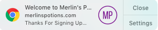
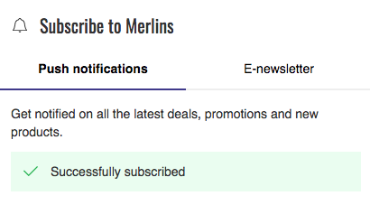
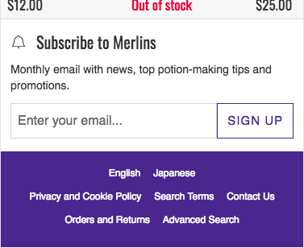
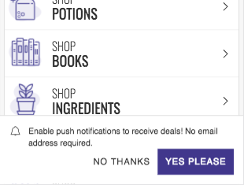

  

    <strong>Important:</strong> We've removed this article from the site navigation because Mobify projects that were generated after January 2019 do _not_ include the push messaging technology described below. If you are maintaining a project that was generated before January 2019 that _does_ include push messaging, we have left this documentation in place for you.
  

In order to test your push opt-in flow, we'll need to do so on another environment, likely a staging environment.

## Setting up the Opt-In on Staging

**Prerequisites:**
- Push has been configured for your site
- An opt-in has been set up

**Steps:**
1. Make sure your staging site is listed as an allowed domain in your YAML file (found in your repo under `/web/messaging/<businessname>.yaml`). The relevant fields are the allowed_secure_domains and allowed_secure_domains fields. Information on the two fields can be found below. If they're not present but needed, add them to your YAML file

    **allowed_insecure_domains and allowed_secure_domains**

    List of domains, optional, empty by default. By default, the web push server is configured to allow only CORS requests from the target_domain and hosting_domain. This can make it difficult to test web push when using a site on a staging or development server. To support testing where the site is using a domain that is neither the target_domain nor the hosting_domain, extra domains may be added to the allowed_insecure_domains or allowed_secure_domains values. They are supplied as a list of extra domains, for example: allowed_secure_domains: [“dev.mysite.com”]

    If a domain is used for HTTP requests, add it to allowed_insecure_domains. If a domain is used for HTTPS requests, add it to allowed_secure_domains. If it is used for both HTTP and HTTPS, add it to both.

2. Publish your bundle to staging

## Testing the Opt-in on staging

### Inline Ask

The [InlineAsk](../../components/#!/InlineAsk) component is typically included “inline” in the app as a compelling way to engage with visitors. For example, it might be presented to visitors in a newsletter email section as a way to hear about deals and news.

#### Step 1: Confirm the Opt-in Component

To preview on staging, simply go to the page on your staging environment where you have added the opt-in component

**NOTE:** If you are already signed up, this may not appear. If that’s the case, clear your cookies and remove your site from the list of allowed notifications in your browser. Then you can try again

<figure class="u-text-align-center">
    

        
    

    <figcaption>Inline Ask Component</figcaption>
</figure>

Confirm the following:

<table align="center">
    <tr>
        <td align="center">Location</td>
        <td align="center">Where on your site to put in the InlineAsk</td>
    </tr>
    <tr>
        <td align="center">Button Copy</td>
        <td align="center">Copy on the button they click to subscribe</td>
    </tr>
    <tr>
        <td align="center">Destination Copy</td>
        <td align="center">Copy that describes what the visitor is subscribing to</td>
    </tr>
</table>

#### Step 2: Successful Opt-In

Click the button to opt-in to messages. There should be confirmation in the component itself and a welcome push notification sent to you.

<figure class="u-text-align-center">
    

        
    

    <figcaption>Welcome Message</figcaption>
</figure>

Confirm the following:

<table align="center">
    <tr>
        <td align="center">Success Copy</td>
        <td align="center">The copy to show if the visitor successfully subscribes
        

            
        

        </td>
    </tr>
    <tr>
        <td align="center">Welcome Push</td>
        <td align="center">The title and body for the push notification sent to confirm your shoppers has been subscribed. You can also choose not to send this welcome message</td>
    </tr>
    <tr>
        <td align="center">Notification Logo</td>
        <td align="center">This is the default logo that will appear on all your notifications including the Welcome Push. It must be 192px by 192px for Chrome. The Safari asset is inflexible and should not be changed
        </td>
    </tr>
</table>

#### Step 3: Already Subscribed Messaging

Refresh your page. Now you can see what the component will look like to users who have already been subscribed. In the example below, the option to subscribe to push notifications is hidden.

Confirm you’re happy with this behaviour.

<figure class="u-text-align-center">
    

        
    

    <figcaption>Hidden Opt-in</figcaption>
</figure>

### Default (Banner) Ask

The [BannerAsk (aka DefaultAsk)](../../components/#!/DefaultAsk) component appears as a sheet at the bottom of the page. Uniquely, it provides a button to dismiss the subscription flow and is typically displayed after the user views a predefined number of pages.

Choosing to dismiss the subscription flow will trigger a visit countdown until the DefaultAsk component is shown again. The number of visits is configured via the component’s deferOnDismissal prop.

#### Step 1: Confirm the Opt-In Component

Your banner will be configured to only show up under certain circumstances. The default for this is on the 3rd page visit. So visit your staging site 3 separate times, and the banner should appear

<figure class="u-text-align-center">
    

        
    

    <figcaption>Default (Banner) Ask</figcaption>
</figure>

Confirm the following:

<table align="center">
    <tr>
        <td align="center">Accept Copy</td>
        <td align="center">Copy on the button they click to subscribe</td>
    </tr>
    <tr>
        <td align="center">Dismiss Copy</td>
        <td align="center">Copy on the button they click to dismiss the banner</td>
    </tr>
    <tr>
        <td align="center">Description Copy</td>
        <td align="center">Copy that describes what the visitor is subscribing to</td>
    </tr>
    <tr>
        <td align="center">Color</td>
        <td align="center">The color on the banner</td>
    </tr>
    <tr>
        <td align="center">Font</td>
        <td align="center">The font on the banner</td>
    </tr>
</table>

#### Step 2: Successful Opt-In

Click the button to opt-in to messages. There should be confirmation in the component itself and a welcome push notification sent to you.

<figure class="u-text-align-center">
    

        
    

    <figcaption>Welcome Message</figcaption>
</figure>

Confirm the following:

<table align="center">
    <tr>
        <td align="center">Welcome Push</td>
        <td align="center">The title and body for the push notification sent to confirm your shoppers has been subscribed. You can also choose not to send this welcome message</td>
    </tr>
    <tr>
        <td align="center">Notification Logo</td>
        <td align="center">This is the default logo that will appear on all your notifications including the Welcome Push. It must be 192px by 192px for Chrome. The Safari asset is inflexible and should not be changed
        </td>
    </tr>
</table>

## Next Steps

You’re set! This process confirms all the settings for your web push notifications.

Once your web push notifications have gone live on your site, you can follow the same steps to subscribe. You will also be able to send yourself a “test message” before each web push notification is sent to your shoppers to confirm the logo & copy. By default, the messages you send your shoppers will contain the same logo as your welcome message.

<b>IN THIS ARTICLE:</b>

