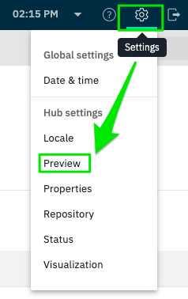

# Storefront Preview + Amplience Proof of Concept

## Table of Contents
<details open><summary>Click to open/close</summary>

- [Video Demo](#video-demo)
- [Overview](#overview)
- [Prerequisites](#prerequisites)
- [Implementation Details](#implementation-details)
  - [Configure Preview URL](#configure-preview-url)
  - [Code Updates](#code-updates)
    - [Storefront Preview Component](#storefront-preview-component)
      - [Additional Search Params](#additional-search-params)
    - [Execute Soft Navigation after Context Change](#execute-soft-navigation-after-context-change)
  - [Code Updates (Optional)](#code-updates-optional)
</details>


## Video Demo
[](https://salesforce.vidyard.com/watch/QVZmM7Z3G2mwzhu3p4Bayb)

## Overview
This [branch](https://github.com/SalesforceCommerceCloud/pwa-kit/tree/sgolden/release-2.8.x-amp-poc) demonstrates how merchants can use [Storefront Preview](https://developer.salesforce.com/docs/commerce/pwa-kit-managed-runtime/guide/storefront-preview.html) with Amplience's preview capabilities.

:warning: **Please note that the API methods in this POC are experimental and subject to removal without notice.** :warning:

## Prerequisites
1. PWA Kit version [2.8.x](https://github.com/SalesforceCommerceCloud/pwa-kit/releases/tag/v2.8.0) or later
2. Amplience Salesforce Composable Commerce version [1.16.0](https://github.com/amplience/amplience-sfcc-composable-commerce/releases/tag/v1.16.0) or later
3. Complete the configuration steps in the [Storefront Preview documentation](https://developer.salesforce.com/docs/commerce/pwa-kit-managed-runtime/guide/storefront-preview.html#configure-storefront-preview)

## Implementation Details

### Configure Preview URL
- [Video Reference](https://salesforce.vidyard.com/watch/QVZmM7Z3G2mwzhu3p4Bayb?second=15)

1. In Amplience, configure your preview URLs to point to Salesforce Managed Runtime preview URL
2. Open Dynamic Content URL: https://app.amplience.net/content/
3. In the top, right hand corner, click the gear icon
   - 
4. Configure your preview URLs following the example below. Replace the bracketed text with your own values; everything else can be left as-is as the tokens are dynamic.
   - `https://runtime.commercecloud.com/[your-mrt-org]/[your-mrt-project]/[your-mrt-env]/preview?effectiveDateTime={{context.timestamp}}&path=/?vse={{vse.domain}}%26vse-timestamp%3D{{context.timestamp}}`
5. Click **Save**

### Code Updates

#### Storefront Preview Component
- [Video Reference](https://salesforce.vidyard.com/watch/QVZmM7Z3G2mwzhu3p4Bayb?second=204)
- [Code Implementation](https://github.com/SalesforceCommerceCloud/pwa-kit/blob/sgolden/release-2.8.x-amp-poc/packages/template-retail-react-app/app/components/_app/index.jsx#L224-L228)
- [Full Commit Diff](https://github.com/SalesforceCommerceCloud/pwa-kit/commit/0bb8c0b79d453492918cbf08910295e1000b2030)

The main update for Amplience customers is to add the Amplience visualization search params (`vse` and `vse-timetamp`) to the StorefrontPreview component via `experimentalUnsafeAdditionalSearchParams` and set `experimentalUnsafeReloadServerSide` = `true`. This will ensure that preview is reloaded on the server side and guarantee that the correct `vse` and `vse-timestamp` values are applied to the `AmplienceContextProvider` wrapper.

[app/components/_app/index.jsx](../../template-retail-react-app/app/components/_app/index.jsx)
```jsx
import StorefrontPreview from 'pwa-kit-react-sdk/storefront-preview'

<Box className="sf-app" {...styles.container}>
   {/* For pwa-kit v2, we need to use this getToken prop to make sure it can work properly
                   with Storefront Preview feature*/}
   <StorefrontPreview
           getToken={() => window.localStorage.getItem('token')}
           experimentalUnsafeAdditionalSearchParams={storefrontPreview.getAdditionalSearchParams()}
           experimentalUnsafeReloadServerSide={true}
   >
      <IntlProvider
```

##### Additional Search Params
- Video References
  - [Using ampProps](https://salesforce.vidyard.com/watch/QVZmM7Z3G2mwzhu3p4Bayb?second=270)
  - [Using Config File](https://salesforce.vidyard.com/watch/QVZmM7Z3G2mwzhu3p4Bayb?second=387)
- [Code Implementation](https://github.com/SalesforceCommerceCloud/pwa-kit/blob/sgolden/release-2.8.x-amp-poc/packages/template-retail-react-app/app/hooks/use-storefront-preview.js#L45-L113)

We need to add the `vse` and `vse-timestamp` search parameters to the URL. Replace the timestamp with a placeholder token `{{effectiveDateTimeUnix}}` so that it can be replaced by the storefront preview service with the current timestamp.

Ref: https://amplience.com/developers/docs/dev-tools/guides-tutorials/content-previews/

An example of the VSE domain is: `kuifkfmrgfsv1qjsmei8dbbnq-gvzrfgnzc-1626217200000.staging.bigcontent.io` so the additional search params would be:

[app/hooks/use-storefront-preview.js](../../template-retail-react-app/app/hooks/use-storefront-preview.js)
```javascript
[
   {
        name: 'vse',
        value: 'kuifkfmrgfsv1qjsmei8dbbnq-gvzrfgnzc-{{effectiveDateTimeUnix}}.staging.bigcontent.io'
     },
     {
        name: 'vse-timestamp',
        value: '{{effectiveDateTimeUnix}}'
   }
]
```

#### Execute Soft Navigation after Context Change
- [Video Reference](https://salesforce.vidyard.com/watch/QVZmM7Z3G2mwzhu3p4Bayb?second=140)
- Code Implementation
    - [use-storefront-preview.js#L152-L161](https://github.com/SalesforceCommerceCloud/pwa-kit/blob/sgolden/release-2.8.x-amp-poc/packages/template-retail-react-app/app/hooks/use-storefront-preview.js#L152-L161)
    - [use-storefront-preview.js#L142-L149](https://github.com/SalesforceCommerceCloud/pwa-kit/blob/sgolden/release-2.8.x-amp-poc/packages/template-retail-react-app/app/hooks/use-storefront-preview.js#L142-L149)

After context is applied, because we set `experimentalUnsafeReloadServerSide` to `true`, a server side refresh is done to ensure the correct `vse` and `vse-timestamp` are applied to the `AmplienceContextProvider` wrapper. Additionally, we need to execute a soft navigation to ensure that the page is re-rendered with the shopper context personalized pricing on the client side. This is done by calling `navigate` with the current path.

```jsx
// in order for the personalized preview pricing and context to be updated
// we need to trigger a re-render of the client side app
// remove the context changed param from the url
const params = new URLSearchParams(location.search)
params.delete(PREVIEW_CONTEXT_CHANGED_QS_PARAM)

// execute a soft navigation to the same page to trigger a re-render of client side context
navigate(window.location.pathname + '?' + params.toString(), 'replace')
```


### Code Updates (Optional)

Additional logic may need to be triggered after shopper context has been applied in Storefront Preview. As seen in the above code, an additional query string param `?__preview_context_changed=1` is added to the search parameters so that customers can watch for and execute any additional logic required. In our example, we issue a call to the SFCC Hooks Collection to get the current customer groups applied to the session:

- [Video Reference](https://salesforce.vidyard.com/watch/QVZmM7Z3G2mwzhu3p4Bayb?second=463)
- [Code Implementation](https://github.com/SalesforceCommerceCloud/pwa-kit/blob/sgolden/release-2.8.x-amp-poc/packages/template-retail-react-app/app/hooks/use-storefront-preview.js#L117-L140)
- [Full Commit Diff](https://github.com/SalesforceCommerceCloud/pwa-kit/commit/ed24399ddaccd7999c531ddc482130053292ffcc)
