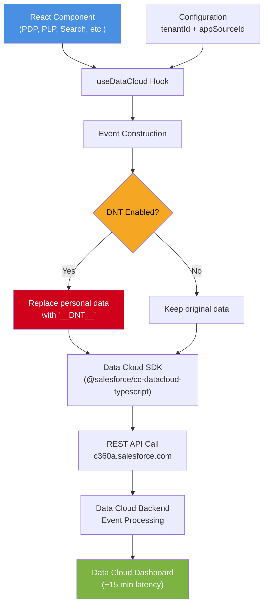
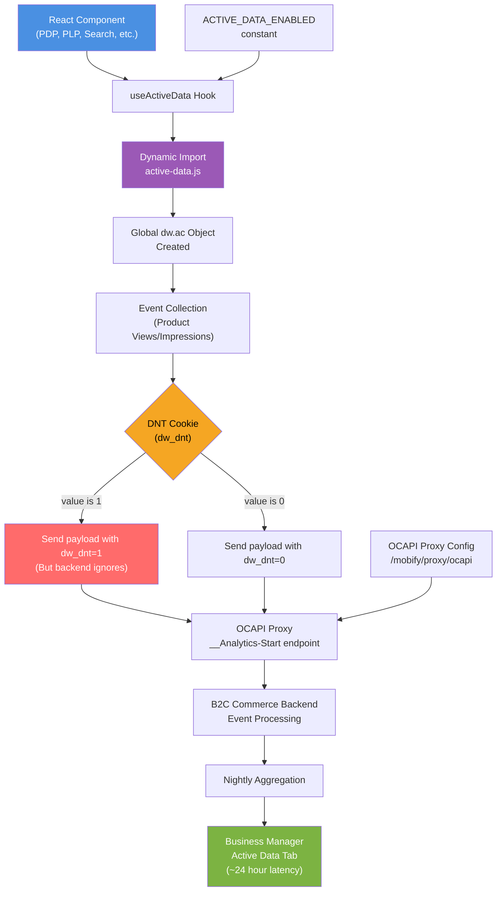
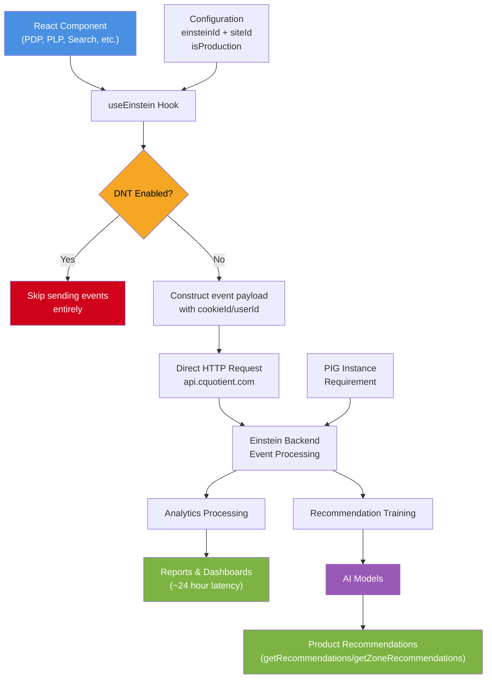

# Support Onboarding: Analytics Session

## Table of Contents
1. [Analytics Providers Overview](#analytics-providers-overview)
2. [General Troubleshooting Strategy](#general-troubleshooting-strategy)
3. [Data Cloud](#data-cloud)
4. [Active Data](#active-data)
5. [Einstein Analytics](#einstein-analytics)
6. [Next Actions](#next-actions)

---

## Analytics Providers Overview

PWA Kit integrates with **three analytics providers**, each serving different business needs:

| Provider | Purpose | Primary Use Case |
|----------|---------|------------------|
| **Data Cloud** | Customer data unification | Latest Salesforce analytics platform for unified customer profiles |
| **Active Data** | Merchandising analytics | Product performance tracking and automated merchandising rules |
| **Einstein** | General analytics + recommendations | Comprehensive analytics with AI-powered product recommendations |

### Common Integration Patterns

All three providers share similar integration approaches in PWA Kit:

#### 1. **React Hook Interface**
- Each provider exposes a custom React hook (`useDataCloud`, `useActiveData`, `useEinstein`)
- Hooks return methods for sending standard e-commerce events (page views, product views, searches, etc.)

**Example Usage in a Product Detail Page:**

```javascript
// pages/product-detail/index.jsx
import useDataCloud from '@salesforce/retail-react-app/app/hooks/use-datacloud'
import useActiveData from '@salesforce/retail-react-app/app/hooks/use-active-data'
import useEinstein from '@salesforce/retail-react-app/app/hooks/use-einstein'

const ProductDetail = ({product, category}) => {
    const dataCloud = useDataCloud()
    const activeData = useActiveData()
    const einstein = useEinstein()
    
    useEffect(() => {
        dataCloud.sendViewProduct(product)
        activeData.sendViewProduct(category, product, 'detail')
        einstein.sendViewProduct(product)
    }, [product?.id])
    
    ...   
}
```


#### 2. **Do Not Track (DNT) Compliance**
- All providers respect user privacy settings
- When DNT is enabled, behavior varies by provider:
  - **Data Cloud**: Replaces personal data with `'__DNT__'` 
  - **Active Data**: Still sends events, but backend ignores them
  - **Einstein**: Skips sending events entirely

#### 3. **All Enabled By Default**
- All providers are enabled by default in `template-retail-react-app`. They have sample configuration values that work.
- But customers will eventually need to configure their own instances and update the configuration values.

---

## General Troubleshooting Strategy

When investigating analytics issues, follow this approach:

### 1. **Narrow Down the Problem Source**
- Is it a frontend issue (events not being sent)?
- Is it a backend issue (events not processed/displayed)?
- Is it a configuration issue?

### 2. **Frontend Verification First**
Since multiple teams are involved end-to-end, start with frontend verification:
- Check if events are being sent from the browser
- Verify event payloads contain expected data
- Confirm configuration is correct

### 3. **Escalation Path**
- If frontend verification passes → escalate to backend team
- If configuration issues → check with the customers
- If code issues → escalate to PWA Kit team

---

## Data Cloud

### Purpose
Data Cloud is Salesforce's latest analytics platform designed to unify customer data across all touchpoints, enabling personalized experiences and comprehensive customer insights.

### How It Works

#### Technical Implementation
- **Hook**: [`useDataCloud`](https://github.com/SalesforceCommerceCloud/pwa-kit/blob/develop/packages/template-retail-react-app/app/hooks/use-datacloud.js)
- **Third-party Library**: [@salesforce/cc-datacloud-typescript](https://www.npmjs.com/package/@salesforce/cc-datacloud-typescript)
- **API Endpoint**: `c360a.salesforce.com`
- **DNT Handling**: Replaces personal identifiers with `'__DNT__'` when DNT is enabled

Data Cloud integration works by:
1. Hook initializes SDK with tenant/app source IDs
2. Events are constructed with base event data + specific event details  
3. Personal data is conditionally replaced with `'__DNT__'` if DNT is on
4. Events sent as interactions to Data Cloud's REST API
5. Data processed and available in Data Cloud's analytics interface



#### Event Types Supported
- `ViewPage` — Page view tracking
- `ViewProduct` — Product detail page views
- `ViewCategory` — Category/listing page views  
- `ViewSearchResults` — Product search tracking
- `ViewRecommendations` — Recommendation impression tracking

### Configuration

See this public doc for more details: https://developer.salesforce.com/docs/commerce/pwa-kit-managed-runtime/guide/integrate-data-cloud.html

#### Prerequisites (Backend)
Customers must complete setup in Data Cloud before frontend configuration:
1. Set up production Data Cloud instance
2. Connect website/mobile app to Data Cloud
3. Create data stream
4. Obtain tenant ID and app source ID

> **Reference**: [Data Cloud Integration Guide](https://developer.salesforce.com/docs/commerce/pwa-kit-managed-runtime/guide/integrate-data-cloud.html)

#### Frontend Configuration
```javascript
// config/default.js
app: {
    dataCloudAPI: {
        appSourceId: 'YOUR_APP_SOURCE_ID',
        tenantId: 'YOUR_TENANT_ID'
    }
}
```

### Verification Steps

#### 1. **Browser Network Tab**
- Look for requests to `c360a.salesforce.com`
- Event payloads are **base64 encoded**
- Check for 200 status responses

#### 2. **Data Cloud Dashboard**
- Navigate to Data Cloud → Data Explorer
- Select data space → Data Model Object → Website Engagement
- **Data latency**: ~15 minutes for events to appear

#### 3. **Testing Flow**
1. Perform shopper activities (search, view product, etc.)
2. Wait 15 minutes
3. Refresh Data Explorer to verify events

### Common Issues

#### Missing Configuration
**Symptom**: No requests to Data Cloud endpoints in browser network tab
**Cause**: Missing `appSourceId` or `tenantId` in PWA Kit configuration
**Solution**: Verify configuration values are present and match customer's Data Cloud setup

#### 400 Bad Request Errors
**Symptom**: Network requests to `c360a.salesforce.com` return 400 status
**Cause**: Based on code implementation, likely incorrect `appSourceId`/`tenantId` or invalid event payload
**Solution**: 
- Verify configuration IDs match customer's Data Cloud setup exactly
- Check browser console for specific error details
- Validate event payload structure

#### Events Not Appearing in Dashboard
**Symptom**: Network requests successful (200 responses) but no data in Data Cloud dashboard after 15+ minutes  
**Cause**: Unknown - requires escalation to Data Cloud team for backend investigation
**Solution**: Escalate with network request evidence showing successful sends

**Note**: Data Cloud integration is newer, so troubleshooting knowledge is still developing. Document additional issues as they're discovered.


---

## Active Data

### Purpose
Active Data provides merchandising analytics by collecting shopper engagement data to help merchandisers optimize product offerings and configure automated rules.

### How It Works

#### Technical Implementation
- **Hook**: [`useActiveData`](https://github.com/SalesforceCommerceCloud/pwa-kit/blob/develop/packages/template-retail-react-app/app/hooks/use-active-data.js)
- **Core Logic**: [Static JavaScript file](https://github.com/SalesforceCommerceCloud/pwa-kit/blob/develop/packages/template-retail-react-app/app/assets/js/active-data.js) dynamically imported
- **API Endpoint**: OCAPI endpoints with `__Analytics-Start` suffix
- **DNT Handling**: Sends events regardless, but backend ignores them when `dw_dnt=1`

Active Data integration works by:
1. Hook dynamically imports the static Active Data JavaScript file
2. File creates global `dw.ac` object with tracking methods
3. Events sent to OCAPI endpoints via configured proxy
4. Backend processes events and aggregates data nightly
5. Aggregated metrics available in Business Manager after 24 hours



#### Events Tracked
| Event | Description |
|-------|-------------|
| Product Impression | Product shown in minimal detail (search results, recommendations) |
| Product View | Product shown in detail (PDP, comparison pages) |
| Order | Customer order placement |

### Configuration

See this public doc for more details: https://developer.salesforce.com/docs/commerce/pwa-kit-managed-runtime/guide/active-data.html

#### Frontend Configuration
```javascript
// app/constants.js
export const ACTIVE_DATA_ENABLED = true
```

Requires OCAPI proxy configuration in PWA Kit Runtime Admin:
- **Path**: `/mobify/proxy/ocapi` 
- **Target Host**: Customer's OCAPI endpoint (e.g., `zzrf-001.dx.commercecloud.salesforce.com`)
- Active Data events are sent to `/mobify/proxy/ocapi/on/demandware.store/Sites-${siteId}-Site/${locale}/__Analytics-Start`

#### Business Manager Configuration
Required settings in Business Manager:
1. **Administration → Sites → Manage Sites**: Ensure site status is **Online**
2. **Merchant Tools → Site Preferences → Privacy Settings**: Set "Tracking (Default for New Storefront Session)" to **Enabled**

> **Reference**: [Active Data Configuration Guide](https://developer.salesforce.com/docs/commerce/pwa-kit-managed-runtime/guide/active-data.html#configure-business-manager)

#### Additional Requirements
- Customer must open support case to enable data collection
- Only works with production environments  

### Verification Steps

#### 1. **Browser Network Tab**
- Look for requests containing `__Analytics-Start` in the URL
- Check request payload for `dw_dnt` parameter
- Verify 200 status responses

#### 2. **Business Manager Verification**
- Navigate to Product Catalog → Select Product → **Active Data** tab
- **Data latency**: 24 hours for metrics to appear/update
- Confirm traffic and conversion metrics are incrementing

#### 3. **Debugging Steps**
If metrics aren't updating:
1. Wait full 24 hours after events
2. Verify `__Analytics-Start` requests return 200 status
3. Check Business Manager site and privacy settings

### Common Issues

#### DNT Impact on Data
**Symptom**: Orders higher than expected and views lower than expected
**Cause**: Users with DNT enabled still complete orders (backend tracking) but views aren't recorded (frontend tracking)
**Context**: This is expected behavior, not a bug. See this [Slack thread](https://salesforce-internal.slack.com/archives/C01JSFFE3HQ/p1749678460701599?thread_ts=1749566800.646919&cid=C01JSFFE3HQ).

#### Missing Events
**Symptom**: No `__Analytics-Start` requests
**Cause**: `ACTIVE_DATA_ENABLED` set to false or OCAPI proxy not configured
**Solution**: Verify frontend constants and proxy configuration

---

## Einstein Analytics

### Purpose
Einstein provides comprehensive analytics and AI-powered product recommendations through integration with Salesforce Commerce Cloud's Einstein platform.

### How It Works  

#### Technical Implementation
- **Hook**: [`useEinstein`](https://github.com/SalesforceCommerceCloud/pwa-kit/blob/develop/packages/template-retail-react-app/app/hooks/use-einstein.js)
- **Direct API Integration**: No third-party libraries, direct HTTP requests
- **API Endpoint**: `api.cquotient.com`  
- **DNT Handling**: Completely skips sending events when DNT is enabled

Einstein integration works by:
1. Hook constructs events with user parameters (cookieId, userId)
2. Events sent directly to Einstein REST APIs with authentication headers
3. Backend processes events for analytics and recommendation training
4. Data aggregated and displayed in Reports & Dashboards after 24-hour delay
5. Recommendation engine uses event data to power personalized product suggestions

**Note**: Consistent `cookieId` across user sessions is critical for accurate analytics and personalized recommendations. Inconsistent cookie IDs can lead to inflated user counts and poor recommendation quality.




#### Event Types Supported
- `ViewProduct` — Product detail page views
- `ViewSearch` — Product search tracking with results 
- `ClickSearch` — Clicks on search result products
- `ViewCategory` — Category/listing page views with products
- `ClickCategory` — Clicks on products from category pages
- `ViewPage` — General page view tracking
- `ViewReco` — Recommendation impression tracking
- `ClickReco` — Clicks on recommended products
- `BeginCheckout` — Checkout process initiation
- `CheckoutStep` — Individual checkout step tracking
- `AddToCart` — Product additions to cart

### Configuration

See this public doc for more details: https://developer.salesforce.com/docs/commerce/pwa-kit-managed-runtime/guide/reports-and-dashboards.html

#### Prerequisites (Backend)
- Only available on PIG instances
- Customer must request Einstein Activities enablement via support case
- **Einstein Configurator**: Configure API access and obtain Einstein client ID (API key)
- **Business Manager**: Configure Einstein Activities as the analytics source

> **References**: 
> - [Einstein Configurator Setup](https://developer.salesforce.com/docs/commerce/einstein-api/guide/einstein-activities-overview.html#enable-access)
> - [Business Manager Configuration](https://developer.salesforce.com/docs/commerce/pwa-kit-managed-runtime/guide/reports-and-dashboards.html#1-configure-business-manager)

#### Frontend Configuration
```javascript
// config/default.js
app: {
    einsteinAPI: {
        host: 'https://api.cquotient.com',
        einsteinId: 'YOUR_EINSTEIN_CLIENT_ID',
        siteId: 'zzrf-RefArch',
        isProduction: false  // Set to true for production data to appear in dashboards
    }
}
```

#### Critical Configuration Notes
- **`host`**: Almost always `api.cquotient.com`
- **`isProduction`**: MUST be `true` for data to appear in Reports & Dashboards
- **`siteId`**: Format is `realm-siteId` (e.g., `zzrf-RefArch`)

### Verification Steps

#### 1. **Browser Network Tab**
- Look for requests to `cquotient.com` domains
- Verify request payloads and 200 responses
- Check `instanceType` field is set to `prd` for production

#### 2. **Chrome Extension**
Install "[Commerce Cloud Recommendation Validator](https://chromewebstore.google.com/detail/commerce-cloud-recommenda/dobmbolmcejainkefklnpkjbaibgjihn)" extension:
- Shows real-time Einstein activity events
- Displays key fields like `realm`, `instanceType`
- Helps debug configuration issues

#### 3. **Reports & Dashboards Verification**
After 24 hours:
1. **Visit the dashboard** at: Business Manager → Merchant Tools → Analytics → Reports & Dashboards (or navigate directly to https://ccac.analytics.commercecloud.salesforce.com/)
2. **Home and Sales tabs**: Verify order numbers match expectations  
3. **Traffic → Shopper Journey**: Check "Visits With Orders" metrics

### Common Issues

#### No Data in Dashboards

**Cause 1: Recent Configuration**
- **Solution**: Wait at least 24 hours after completing setup

**Cause 2: Configuration Errors**  
- **Symptoms**: `instanceType` not `prd`
- **Solution**: Ensure `isProduction: true` in configuration

#### Missing Events
**Symptom**: Some analytics events not appearing
**Cause**: DNT enabled users, incomplete event implementation, or network issues  
**Solution**: Check DNT settings, verify event firing in code, check network logs

#### Inaccurate Dashboard Data
**Symptom**: User counts, order counts, or revenue metrics don't match expectations
**Causes**: 
- **Inconsistent cookieId values** across user sessions leading to inflated user counts and poor recommendation quality
- Events sent with incorrect product pricing or quantities
- Missing or duplicate events in the analytics flow
**Solution**: 
- Monitor `cookieId` consistency across page visits
- Verify event payload accuracy and avoid sending duplicate events

---
## Resources

### Reference Links
- [Einstein Reports & Dashboards Documentation](https://developer.salesforce.com/docs/commerce/pwa-kit-managed-runtime/guide/reports-and-dashboards.html)
- [Active Data Documentation](https://developer.salesforce.com/docs/commerce/pwa-kit-managed-runtime/guide/active-data.html)  
- [Data Cloud Integration Documentation](https://developer.salesforce.com/docs/commerce/pwa-kit-managed-runtime/guide/integrate-data-cloud.html)

### Internal Documentation
- **Active Data Internal Doc**: [Quip Link](https://salesforce.quip.com/Ar7lADMMF0MC)
- **Einstein Runbook**: [Quip Link](https://salesforce.quip.com/aZkgAjUfEvKI)

### Slack Channels for Support
- TODO

### Key Contacts
- TODO


## Demo Environment
**Reference Site**: [pwa-kit.mobify-storefront.com](http://pwa-kit.mobify-storefront.com)

- Use this site for comparison, in case you need to know what the correct behaviors should be like

---
## Next Actions

### Required Permissions and Access

#### For Data Cloud Support
- [ ] Access to dashboards. TODO: ask Carson or Yuna

#### For Active Data Support  
- [ ] Business Manager access to verify configurations

#### For Einstein Support
- [ ] Account Manager access with Reports & Dashboards role
- [ ] Business Manager access for verification
